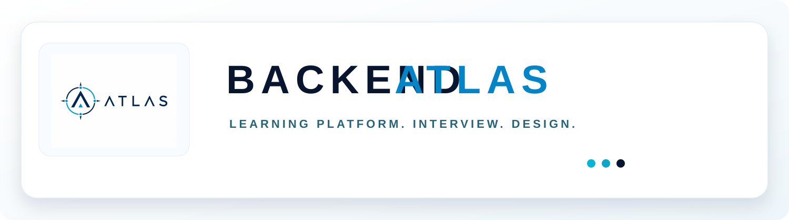

<p align="center">
  
</p>

# Backend Atlas

AX·Backend 엔지니어가 기술을 외우는 데서 그치지 않고 원리를 설명하고 설계를 방어할 수 있도록 만든 로컬 우선 학습 플랫폼입니다.

## 주요 기능

- 5,000개 객관식·시나리오 문제와 7개 분야별 심층 챕터
- 정의 → 필요성 → 내부 원리 → 장단점 → Trade-off → 실무/장애 사례 학습 흐름
- 챕터별 면접 질문 TOP20, 모범 답변, 꼬리 질문, 답변 팁
- 문제·오답·해설에서 확인하는 6단계 Why 분석
- 선행·연관·후행 개념을 계속 탐색하는 지식 그래프
- 오늘 목표, 연속 학습, 약점 분석, 오답 우선 복습
- 로컬 저장소 기반 학습 기록 유지
- Capacitor Android 앱
- 분야 카드 → 챕터 → 개념 상세로 이어지는 모바일 중심 학습 UX
- Java Core/JVM/Spring Core/Spring Data/Spring Boot 운영 커리큘럼
- 선택지별 정답·오답 근거와 실무·면접 답변 해설
- 모든 핵심 개념의 비교표와 Oracle·Spring·PostgreSQL 등 공식 문서 링크
- Backend Atlas·Archive Nexus·ArchiveOS 실제 구현 기반 Developer Guide
- 브라우저 history와 Android WebView에서 동일하게 동작하는 직전 화면 복귀
- `/learn/?job=<id>&topic=<title>` Incruit Atlas 딥링크를 검색·학습·면접 화면으로 연결
- 단어 경계와 alias를 기준으로 개념을 찾는 검색(LocalStorage → Web Storage API)
- 선택 즉시 저장되는 퀴즈 세션과 중단 세션 이어 풀기·보관
- 학습 요약 저장·복습 등록·완료일·3일 후 복습 예정일 관리
- 5개 탭(요약·원리·비교·실무·면접) 기반의 집중 학습 화면
- 반응형 인터랙티브 시스템 구성도와 노드별 역할·입력·출력·구현 파일 안내
- 콘텐츠 중복·출처·내부 동작·선택지 편향을 검사하는 품질 감사 보고서
- JVM memory, HashMap, ArrayList/LinkedList, B-Tree, Web request, Spring MVC, RAG, Container 구조 SVG 학습 도식
- 공식 JD·공개 안전한 경력 근거를 연결하는 Interview Lab
- 15분 점검부터 90분 심층 면접, 경력·포트폴리오 방어, 시스템 설계, Java·SQL, 장애·AI/AX까지 15개 훈련 모드
- 질문 우선 → 답변 → 자가 평가 → 20초·90초 기준 답안 → 꼬리질문 → 복습일의 면접 학습 흐름
- Incruit Atlas `/learn/?mode=interview&job=<id>&topic=<role>` 맞춤 질문팩 handoff와 안전한 공통 fallback
- private profile JSON의 session-only import, 답변 원문의 명시적 opt-in 로컬 저장, D-Day Top 30 인쇄
- 별도 `/learn/backend-study/`에서 제공하는 21챕터·32일 백엔드 실무 학습
- 매 DAY의 개념 → Worked Example → 안내 실습 → 독립 실습 → 증거 검증 → 회상 평가 → 간격 복습
- 하나의 `data/backend-study/` 정규화 소스에서 웹·192문항 평가·32개 실습·인쇄용 PDF 생성

학습 내용은 Oracle·Spring·PostgreSQL 등 공식 문서와 공개 기술 면접 자료의 주제 범위를 참고해 독자적으로 재구성했습니다. 원문 문장을 복제하지 않으며 앱 안에서 원본과 공식 문서 링크를 함께 제공합니다.

## 기술 스택

- Web: HTML5, CSS3, Vanilla JavaScript
- Data/Search: 로컬 JavaScript 지식 인덱스, 브라우저 LocalStorage
- Mobile: Capacitor 8, Android Gradle Plugin
- Quality: Node.js, JSDOM smoke test
- Delivery: PWA Service Worker, ngrok 원격 터널

## 프로젝트 구조

```text
Backend-Atlas/
├─ index.html                 # 애플리케이션 화면 구조
├─ app.js                     # 퀴즈·진행률·약점 분석
├─ learning-os.js             # 검색·Why·지식 그래프 UI
├─ interview/                 # Interview Lab UI·상태·채점·import·router 모듈
├─ data/interview/            # job/source/fact/질문팩/품질 계약
├─ backend-study/             # 백엔드 실무 학습 독립 페이지·상태·런타임
├─ data/backend-study/        # 21챕터·32일·실습·평가·출처 canonical source
├─ atlas-content.js           # 심층 챕터·TOP20·강화 메타데이터
├─ curriculum-data.js        # 공식 문서 기반 커리큘럼·비교·품질 문제
├─ developer-guide-data.js   # 세 프로젝트 architecture와 기술 딥링크
├─ questions.js               # 기본 문제 데이터
├─ question-expander.js       # 문제 확장
├─ ax-question-extension.js   # AX·실무 시나리오 확장
├─ learning-os-data.js        # 5,000문제 정규화와 검색 기반
├─ styles.css                 # 반응형 UI와 제품 디자인
├─ assets/                    # Backend Atlas 브랜드 자산
├─ scripts/                   # 웹 빌드, smoke test, Interview Lab 데이터·감사
└─ android/                   # Capacitor Android 네이티브 프로젝트
```

## 웹 실행과 검증

```powershell
npm install
npm test
npm run quality:audit
npm run test:interview
npm run test:backend-study
npm run backend-study:audit
npm run build
npx serve . -l 4173
```

품질 감사 결과는 `reports/content-quality-report.md`와 JSON 파일로 생성됩니다. 경고는 콘텐츠 개선 backlog이며 오류는 출처·내부 동작·비교표·중복 데이터의 구조적 결함을 의미합니다.

현재 원격 주소: `https://donation-contest-handlebar.ngrok-free.dev`

## Android 빌드

```powershell
npm run build
npx cap sync android
cd android
.\gradlew.bat assembleDebug --no-daemon
```

원본 APK는 `android/app/build/outputs/apk/debug/app-debug.apk`, 전달용 APK는 `dist/BACKEND_ATLAS_debug.apk`입니다.

폰으로 APK를 옮긴 뒤 파일을 열고, Android 설정에서 해당 파일 관리자 또는 브라우저의 **알 수 없는 앱 설치 허용**을 켜면 설치할 수 있습니다. 기존 `com.danchon.techreview` 패키지를 유지하므로 이전 앱 위에 업데이트 설치되며 로컬 학습 기록도 유지됩니다.

## 데이터 구조

- `questions.js`, `question-expander.js`, `ax-question-extension.js`: 기본 문제와 확장 문제
- `learning-os-data.js`: 5,000문제 정규화 및 로컬 검색 기반
- `atlas-content.js`: 심층 챕터, 지식 그래프, TOP20 면접 데이터, 강화 메타데이터
- `learning-os.js`: 검색, Why, 관련 개념 탐색
- `app.js`: 퀴즈, 진행률, 약점과 복습 상태

실제 LLM 없이 동작하며 이후 검색 인터페이스를 PostgreSQL/pgvector 또는 embedding 기반 RAG로 교체할 수 있도록 콘텐츠와 표시 계층을 분리했습니다.

## 제품·경로 계약

| Surface | Canonical value |
|---|---|
| 제품명 / 브라우저 title / README | Backend Atlas |
| 기능명 | Interview Lab |
| GitHub repository | Backend-Atlas |
| OCI/Nginx 공개 경로 | `/learn/` |
| 백엔드 실무 학습 | `/learn/backend-study/` |
| 기존 호환 경로 | `/run/` → `/learn/` |
| Incruit handoff | `/learn/?mode=interview&job=<id>&topic=<role>` |
| Portfolio 표기 | Backend Atlas · Interview Lab |

공개 정적 자산에는 전화번호, 이메일, 주소, 생년월일, 희망연봉, 지원 완료 여부, 비공개 답변, private profile을 포함하지 않습니다.
